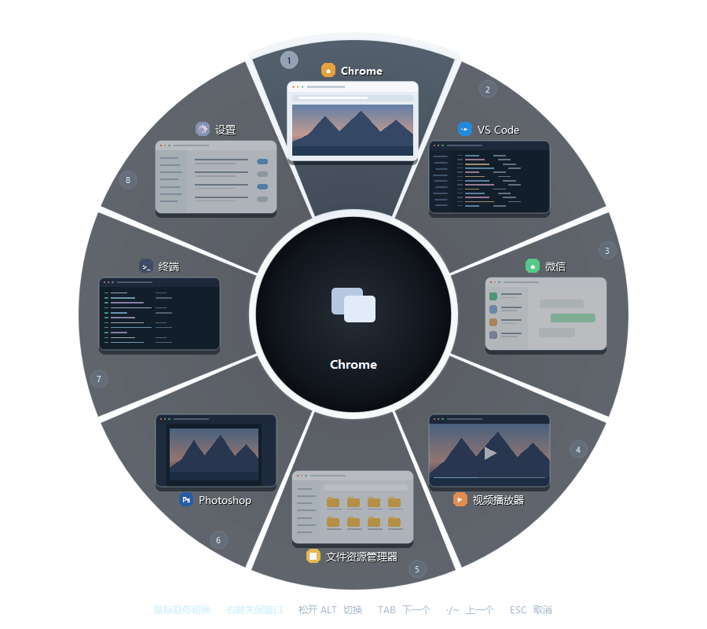

# Radial Alt+Tab

**一眼找到要切换的窗口。** 按下 `Alt + Tab`，所有可切换窗口会围成一个圆环，名称和预览同时呈现。继续按键或移动鼠标选中目标，松开 `Alt` 即可切换。



## 下载与使用

1. 从 [Releases 下载 RadialAltTab.exe](https://github.com/suzeccc/RadialAltTab/releases/latest)，双击运行。它是 Windows 单文件程序，无需安装 Python。
2. 按住 `Alt`，按 `Tab` 呼出切换器；继续按 `Tab` 或将鼠标移到目标窗口。
3. 松开 `Alt` 切换。程序会留在系统托盘，右键托盘图标可调整设置或退出。

首次启动默认请求管理员权限，以便切换到以管理员身份运行的窗口。拒绝授权后仍可使用普通权限；此时切换管理员窗口可能受 Windows 限制。可在托盘菜单中调整“管理员运行”，更改在下次启动时生效。

## 操作速查

| 操作 | 效果 |
| --- | --- |
| 按住 `Alt`，反复按 `Tab` | 依次选择下一个窗口 |
| 按住 `Alt`，按 `` ` `` / `~` 键 | 选择上一个窗口 |
| 松开 `Alt` 或按 `Enter` | 切换到选中的窗口 |
| 鼠标悬停或滚轮 | 选择窗口 |
| 鼠标左键单击扇区或预览 | 立即切换；点击圆环外取消 |
| `Esc` | 取消切换 |
| `Delete` 或鼠标右键 | 请求关闭选中的窗口；未保存内容由目标应用确认 |

## 可以调整什么

- **窗口映射**：按程序的 EXE 名自定义窗口名称；取消勾选只停用映射，不会隐藏窗口。
- **背景与主题**：选择透明、浅深、轻微模糊、高斯模糊或亚克力背景，以及深色、浅深色、深海蓝、暮紫、薄荷绿主题。首次运行默认使用深色主题和透明背景。
- **操作习惯**：可关闭鼠标悬停、滚轮和左键切换；右键关闭窗口仍可使用。
- **托盘选项**：切换简体中文、繁体中文或英语，设置开机启动、管理员运行，或手动检查更新。

某些窗口无法提供缩略图时，会显示图标或占位图。普通窗口切换无需联网；只有手动检查更新会连接 GitHub，窗口信息仅用于本机切换。

<details>
<summary>从源码运行或自行构建</summary>

需要 Windows 和 Python。在项目目录执行：

```powershell
python -m pip install -r requirements.txt
python radial_tab.py
```

构建单文件 EXE：

```powershell
python -m pip install pyinstaller==6.21.0
powershell -ExecutionPolicy Bypass -File .\build.ps1
```

生成的文件位于 `dist\RadialAltTab.exe`。

</details>

本项目采用 [MIT 许可证](LICENSE)。
